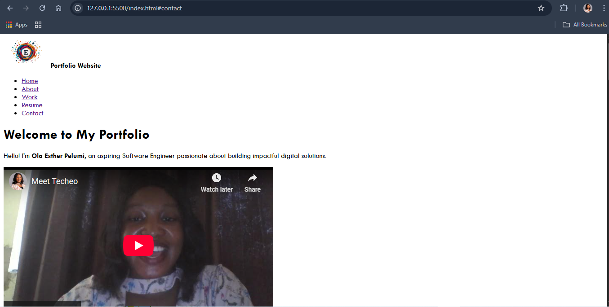

# HTML Portfolio Website

A simple **personal portfolio website** built with only **HTML**.  
This project showcases my profile, projects, resume, and contact form in a clean and structured way without any CSS or JavaScript frameworks.

## Features

- **Navigation bar** for easy access to different sections.
- **About Section** – A short introduction about me.
- **Work Section** – Displays some of my personal projects with demo and repo links.
- **Resume Section** – Includes my education, skills, and projects.
- **Contact Section** – Simple contact form to collect user details and messages.
- **Footer** – Contains quick links and contact information.

## Project Structure

```bash
.
├── index.html
├── image/
└── README.md
```

````

## How to Use

1. Clone the repository:

   ```bash
   git clone https://github.com/your-username/html-portfolio.git
   ```

2. Open the `index.html` file in your browser.

No server setup or dependencies are required since this project is built with **pure HTML**.

## Screenshots

**Live Screenshot 001.**
 


## Technologies Used

- HTML5 (semantic elements)
- Basic form fields and structure
- Accessible markup

© 2025 Ola Esther Pelumi. All rights reserved.

```
````
